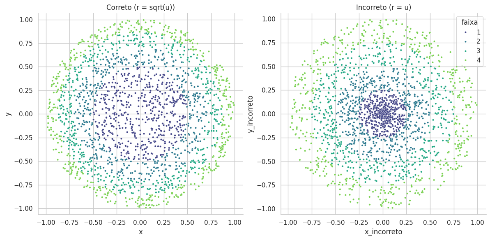

# Simulação de Pontos Uniformes no Disco (Uniform Point Sampling)

Este repositório contém um estudo probabilístico e uma implementação computacional sobre como gerar pontos aleatórios uniformemente distribuídos num disco. O projeto demonstra matematicamente e visualmente por que a abordagem intuitiva de coordenadas polares falha e como corrigi-la usando o **Método da Transformada Inversa**.

## Sobre o Projeto

Durante a **XXV Semana da Matemática & XV Semana da Estatística da UFU**, este trabalho foi apresentado para responder a uma pergunta clássica de probabilidade:

> *"Como sortear pontos de forma que a densidade seja constante em todo o disco?"*

Intuitivamente faz sentido tentar gerar um raio $R$ e um ângulo $\Theta$ uniformemente. No entanto, isso cria um **viés radial** (aglomeração de pontos no centro), pois anéis menores perto do centro recebem a mesma quantidade de pontos que anéis maiores na borda.

Este projeto resolve isso aplicando uma correção não-linear ao raio: $R \sim \sqrt{U}$.

## Conteúdo do Repositório

* **[`relatorio_circ.pdf`](relatorio_circ%20(1).pdf)**: Relatório técnico/Pôster contendo a dedução matemática completa, cálculo do Jacobiano e a prova pelo Teorema da Transformada Inversa.
* **[`uniforme_circ.ipynb`](uniforme_circ%20(2).ipynb)**: Notebook Jupyter com a implementação em Python, simulação de Monte Carlo e visualização de dados.

## Tecnologias Utilizadas

* Python (Numpy, Pandas, Matplotlib)
* Jupyter Notebook

## A Matemática (Resumo)

Para garantir uniformidade na área, a densidade de probabilidade marginal do raio deve crescer linearmente com $r$.

1.  **Abordagem Intuitiva (Incorreta):**
    $$R \sim U[0, 1]$$
    *Resultado:* Alta concentração no centro.

2.  **Abordagem Correta (Transformada Inversa):**
    A Função de Distribuição Acumulada (CDF) necessária é $F_R(r) = r^2$. Invertendo-a para uma variável uniforme $U \sim [0,1]$:
    $$R = \sqrt{U}$$
    *Resultado:* Distribuição uniforme em área.

| 

## Exemplo de Código

O trecho principal da simulação (do arquivo `uniforme_circ.ipynb`):

```python
import numpy as np

n = 2000
u = np.random.rand(n)
v = np.random.rand(n)

# Método Incorreto (Viés no centro)
r_naive = u 

# Método Correto (Correção da área)
r_correct = np.sqrt(u) 

theta = 2 * np.pi * v

# Conversão para Cartesiano
x = r_correct * np.cos(theta)
y = r_correct * np.sin(theta)
```

## Arquivos
* [**Relatório Matemático (PDF)**](uniforme_circulo%20(1).pdf) - Dedução completa.
* [**Simulação (Notebook)**](uniforme_circ%20(2).ipynb) - Código e gráficos.

---
**Autor:** Matheus de Moraes | [LinkedIn](https://www.linkedin.com/in/matheus-neves-864aa01a8/)
